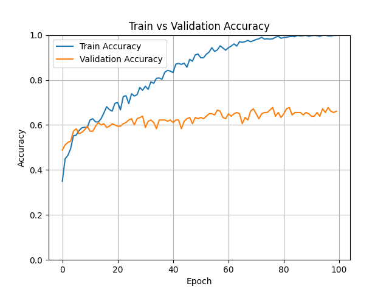

# Enhancing Multilingual AI Analyzing and Modeling Educational Content with the FineWeb-C


This project uses pretrained BERT models to classify the quality of educational texts using data from huggingfaces fineweb-c and fineweb2. It compares the performance of deep learning approaches with a traditional readability score (LIX). We implement fine-tuning of BERT, custom loss functions, and evaluation metrics to explore model behavior in imbalanced data scenarios.

## Table of Contents
- [Installation](#installation)
- [Usage](#usage)
- [Data](#data)
- [Model](#model)
- [Results](#results)

## Installation
The project uses version python 3.13

Clone the repo:
```bash
git clone https://github.com/Shadoughcake/Enhancing-Multilingual-AI-Analyzing-and-Modeling-Educational-Content-with-the-FineWeb-C.git

cd Enhancing-Multilingual-AI-Analyzing-and-Modeling-Educational-Content-with-the-FineWeb-C

pip install -r requirements.txt
 ```
 

## Usage
To train the model:
```bash
python BERTtransformer.py
```

To change the settings go into `BERTtransformer.py` and change the top settings.
```
Binary_Classification = False  # Set to True for binary classification, False for multiclass
MAX_LEN = 128*4
TRAIN_SIZE = 0.8
TRAIN_BATCH_SIZE = 4
VALID_BATCH_SIZE = 4
EPOCHS = 100
LEARNING_RATE = 1e-06
DROPOUT = 0.5
LOSS_FUNCTION = "l1"  # Options: "weighted", "l1", "l1+weighted", "None"

SEED = 200


# Use 0 for danish, 1 for english, 2 for multilingual
Pretrained_models = ["Maltehb/danish-bert-botxo","bert-base-uncased","bert-base-multilingual-cased"]
Pretrained_model = Pretrained_models[0]

```
You can generate the LIX scores using `LIXCLASSIFIER.ipynb`.


## Data
This project uses the [Fineweb-c](https://huggingface.co/datasets/data-is-better-together/fineweb-c#fineweb-c-educational-content-in-many-languages-labelled-by-the-community) dataset and the bigger dataset [Fineweb2](https://huggingface.co/datasets/HuggingFaceFW/fineweb-2) dataset from Huggingface.


The dataset is located in `annotations Data/` and consists of educational texts labeled by quality. 
The main 2 datasets that are used in this project are, `fineweb-c-relabled.csv` and `fineweb2_data.csv`. The others are subsets or earlier stages of the aforementioned data.


## Model

We fine-tune a pretrained BERT model by adding a classification head and use dropout for regularization.
```
class BERTClass(torch.nn.Module):
    def __init__(self):
        super(BERTClass, self).__init__()
        self.l1 = BERTmodel
        self.l2 = torch.nn.Dropout(DROPOUT)
        self.l3 = torch.nn.Linear(768, len(unique_labels))

    def forward(self, ids, mask, token_type_ids):
        _, output_1= self.l1(ids, attention_mask = mask, token_type_ids = token_type_ids, return_dict=False)
        output_2 = self.l2(output_1)
        output = self.l3(output_2)
        return output
 
```
The optimizer used is Adam `optimizer = torch.optim.Adam(params =  model.parameters(), lr=LEARNING_RATE)`


We include class weighting and a custom L1-penalized loss to encourage semantically close predictions.
For multiclass prediction we used the loss function CrossEntropyLoss and for binary classification BCEWithLogitsLoss was used. The L1 loss function is given by:
```
 # --- L1 Distance Weighting ---
 pred_indices = torch.argmax(preds, dim=1)
 target_indices = torch.argmax(targets, dim=1)
 l1_dist = torch.abs(pred_indices - target_indices).float()
 l1_weights = 1.0 + l1_dist  # Base weight=1, scaled by L1 distance

 return (CE_loss_fn(outputs, target_indices) * l1_weights).mean()  # Mean L1 weighted loss
```


## Results
Accuracy and loss function graphs are generated when you run `BERTtransformer.py` as well as `MC.csv` which is a csv containing missclassied samples per epoch, and `CMS.json` file which can be converted into a confusion matrix using `Results/RESULTS.ipynb` to further interperet the results.

Results from using L1 loss function.

| Model | Accuracy | F1-score (weighted) | L1-score |
|-------|----------|------------------|----|
| danish-bert-botxo | 66.58% | 0.6525 | 0.4121|
| bert-base-multilingual-cased	| 58.65% | 0.5930 | 0.4851 |

L1 on with the danish tokenizer run on 100 epoch with a lr 1e-6



